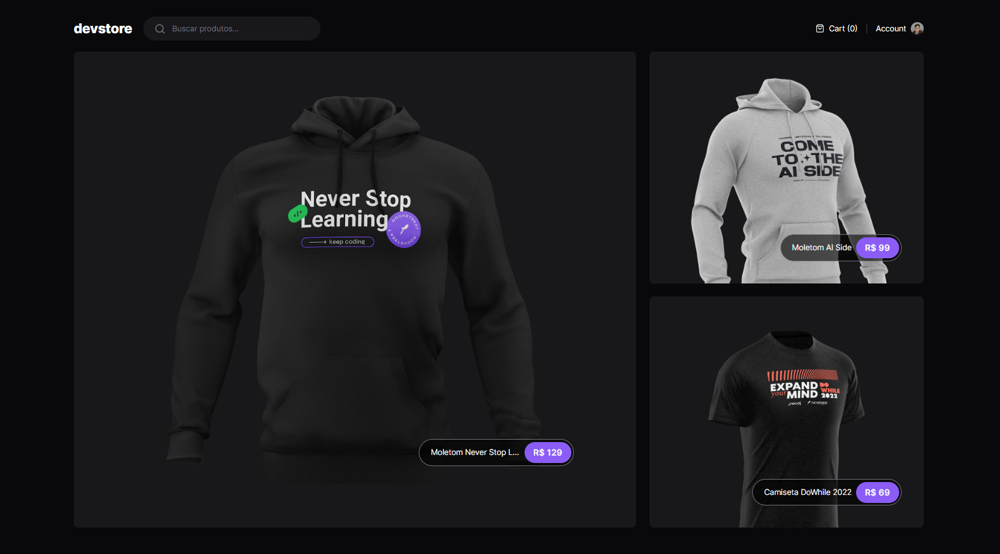

# DevStore

Este é um projeto desenvolvido com Next.js, que utiliza novos conceitos da **App Router** como Server Components, Loading Pages e Layout. O projeto consiste em um e-commerce que consome uma [API](https://ignite-devstore-api.vercel.app/api/products) de produtos.

## Funcionalidades Principais

- **Página Principal:** Exibe os produtos em destaque ("feature").
- **Página Detalhada do Produto:** Permite visualizar informações detalhadas de cada produto.
- **Pesquisa de Produtos:** Funcionalidade que possibilita buscar produtos por nome ou categoria.

## Tecnologias Utilizadas

- **Next.js:** Framework React focado em renderização no servidor.
- **Tailwind CSS:** Framework CSS utilizado para estilização.
- **Cypress:** Utilizado para testes end-to-end (E2E), simulando o comportamento do usuário na aplicação.
- **Zod:** Biblioteca de validação de esquema para JavaScript.
- **@t3-oss/env-nextjs:** Utilizado para gerenciar variáveis de ambiente no Next.js.

## Como Executar o Projeto

### Pré-requisitos

Certifique-se de ter o Node.js instalado na sua máquina.

### Passos para Execução

1. Clone o repositório: `git clone https://github.com/seu-usuario/devstore.git`
2. Acesse o diretório do projeto: `cd devstore`
3. Instale as dependências: `npm install`
4. Inicie a aplicação: `npm run dev`

## Testes E2E com Cypress

1. Certifique-se de ter o projeto em execução.
2. Abra outro terminal na pasta do projeto.
3. Execute os testes Cypress: `npx cypress run`
